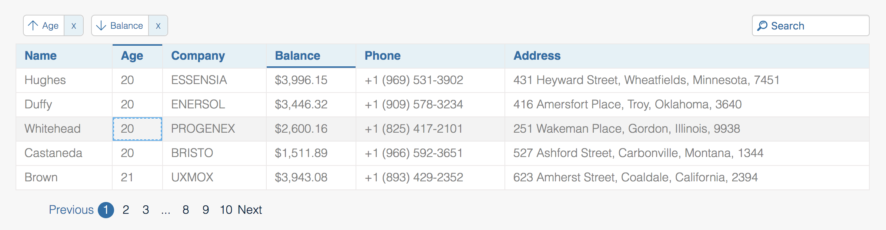

# react-url-table
> Build data grid just by URL. Based on React16 hooks and [mobx-react](https://github.com/mobxjs/mobx-react-lite). MIT License.



[Check Component storybook](https://ekokotov.github.io/react-url-table)

### ENV:
Typescript, Webpack, React 16 hooks, Mobx-react (for optimized store management)
### Tests:
jest, enzyme, enzyme-adapter-react-16

## Usage

```jsx
 <UrlTable
    url="https://next.json-generator.com/api/json/get/4k6xmJ21r"
    headers={['Name', 'Age', 'Eyes', 'Phone', 'Favorite fruit']}
    fields={['name', 'age', 'eyeColor', 'phone', 'favoriteFruit']}
    pagination={{
        pageSize: 5
    }}
    indexField={'_id'}
/>
```

## Features
- load by URK or display local data
- pagination
- sorting by multiple columns
- global search
- search by specified column
- custom render components
- select single or multiple rows
- edit cells

### Component Props

| Prop             | Type                                  | Required | Default                                                                                        | Info                                                                                                                                                                                                                                                                                 |
|:-----------------|:--------------------------------------|:---------|:-----------------------------------------------------------------------------------------------|:-------------------------------------------------------------------------------------------------------------------------------------------------------------------------------------------------------------------------------------------------------------------------------------|
| data             | Array                                 | yes/no   | -                                                                                              | Array of objects [{}, {}]. property **data** or **url** required                                                                                                                                                                                                                     |
| url              | String                                | yes/no   | -                                                                                              | Property **data** or **url** required                                                                                                                                                                                                                                                |
| fetchSuccess     | Function                              | no       | -                                                                                              | (res: any) => []. This function will be called to map/parse data request from before render                                                                                                                                                                                          |
| fields           | Array of Strings or IFieldPropObject  | yes      | -                                                                                              | You can pass any deep property name of object in prop-dot format `prop1.prop2`                                                                                                                                                                                                       |
| headers          | Array of Strings or IHeaderPropObject | no       | -                                                                                              | don't specify this props if you want to render table without header                                                                                                                                                                                                                  |
| indexField       | String                                | yes      | -                                                                                              | uniq object property. used for performance index ('uuid', 'id', '_id')                                                                                                                                                                                                               |
| search           | Boolean                               | no       | false                                                                                          | To use global search across all columns just pass `true`. It's possible to search just by specified columns                                                                                                                                                                          |
| sorting          | String or Boolean                     | no       | 'simple'                                                                                       | with 'simple' table data will be sorted by single column. <br> Setting 'compound'  allows you to make sorting by few columns at the same time.<br> Do disable sorting use `false`                                                                                                    |
| showSortingPanel | Boolean                               | no       | true                                                                                           | show soring panel with badges of current sorting state                                                                                                                                                                                                                               |
| onSelect         | Function                              | no       | -                                                                                              | (record: SelectedRows[]) => void.  This function will be called by table row clicking/selecting.                                                                                                                                                                                     |
| selectMode       | String or Boolean                     | no       | false                                                                                          | single                                                                                                                                                                          \| multiple \| false . Highlight and execute `onSelect` callback by selecting one or few table rows. |
| loadingComponent | Function                              | no       | -                                                                                              | (isLoading?: boolean) => React.ReactElement. Use custom Loading component                                                                                                                                                                                                            |
| pagination       | IPaginateProps or Boolean             | no       | <code>{<br/>pageSize: 10,<br/>pageRangeDisplayed: 5,<br/>marginPagesDisplayed: 1<br/>},</code> | For pagination it uses [react-paginate](https://www.npmjs.com/package/react-paginate) component.  You can pass any `react-paginate` property to `pagination`. <br>Set `false` to hide pagination.                                                                                    |
| editable         | Boolean                               | no       | false                                                                                          | editable={true} makes all cells editable. NOTE: You can pass editable={boolean} in IHeaderPropObject to make certain cells editable                                                                                                                                                  |
| onEdit           | Function                              | no       | -                                                                                              | onEdit: (newValue: string, propertyName: string, record: IRecord) => void. This callback will be called after cell editing (onBlur)                                                                                                                                                  |

> NOTE: existing of property `data` or `url` is required to display table.
### Configurable Cell:
```typescript
interface IFieldPropObject {
    property: string,
    // IRecord is data object
    render?(cellValue: any, object: IRecord): string | React.ReactElement
}
```

### Configurable Header:
```typescript
interface IHeaderPropObject {
    name: string,
    property?: string,
    sortable?: boolean,
    searchable?: boolean,
    editable?: boolean,
    // render returns string or react element
    render?(name: string): string | React.ReactElement
}
```

### Pagination Props:
For pagination it uses [react-paginate](https://www.npmjs.com/package/react-paginate) component. You can pass any `react-paginate` property to `pagination`

```typescript
import {ReactPaginateProps} from "react-paginate";

interface IPaginateProps extends Partial<ReactPaginateProps> {
    pageCount?: number,
    currentPage?: number,
    pageSize: number
}
```

## Styles
import react-url-table/styles/index.css into your component. BTw you can override table styles by passing your custom className.

> Note: `pageSize` property is required
### Features TODO:
- [ ] reorder rows (drag-n-drop)
- [ ] reorder columns (drag-n-drop)
- [ ] resize column width
- [ ] custom row pattern/component
- [ ] column highlighting (CSS only)
- [ ] Themes supporting
